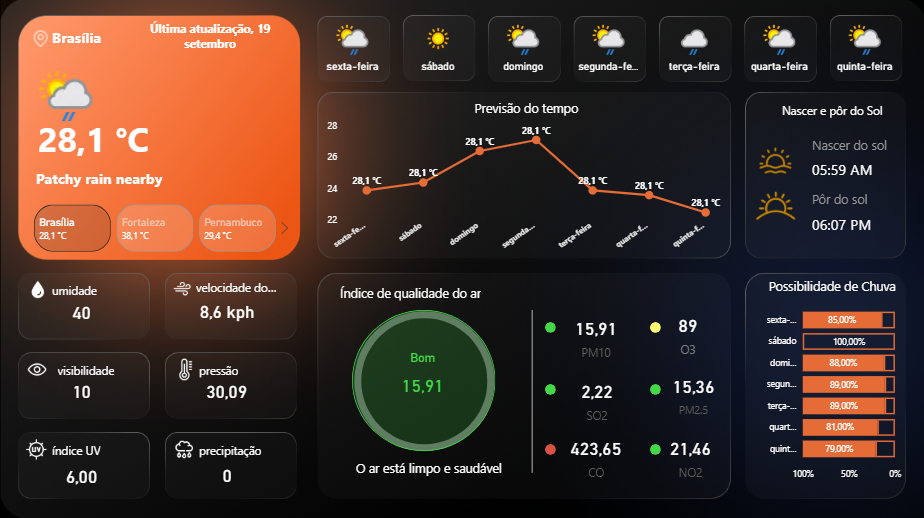
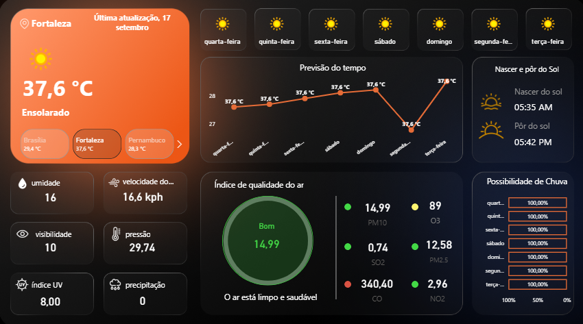

# Climate Air Quality Dashboard

This project is an interactive air quality dashboard built with Power BI.

## Overview

The dashboard analyzes environmental and air quality indicators through visual reports and charts.

The goal of this project was to practice data analysis, dashboard design, and visual storytelling using Power BI.

## Dashboard Preview

### Main Dashboard

### Air Quality Analysis

### Weather Forecast

## Features

- Air quality visualization
- Environmental data analysis
- Interactive dashboard layout
- Data storytelling
- Visual reporting

## Tech Stack

- Power BI
- Data Analysis
- Data Visualization

## What I Learned

- Building dashboards with Power BI
- Organizing visual reports
- Presenting data insights clearly
- Improving dashboard layout and readability

## Portfolio Note

This project is part of my data analysis learning journey and supports my transition into Web3 data and on-chain analytics.

Data visualization is an important skill for understanding blockchain metrics, token distribution, and ecosystem activity.
